```mermaid
graph TD
    P[🔧 Pre-Stage Setup: Create Demo Branch]
    P --> A[🔍 Phase 1: Issue Discovery]
    A --> B[📝 Phase 2: Issue Management via GitHub MCP]
    B --> C[🌿 Phase 3: Create Hotfix Branch]
    C --> D[🛠️ Phase 4: Local Development & Fix]
    D --> E[📤 Phase 5: Push & Create PR]
    E --> F[🎉 Phase 6: Merge & Close Issue]
    F --> G[🔧 Phase 7: Post-Demo Cleanup]
    
    P1["Create 'demo' branch for safe demonstration"] --> P
    A1["Human: Website styling broken! AI: Investigate"] --> A
    B1["Create issue with MCP tools"] --> B
    C1["Branch: hotfix/css-stylesheet-typo"] --> C
    D1["Fix: styls.css → styles.css"] --> D
    E1["Push + Auto-link PR to issue"] --> E
    F1["Merge PR + Close issue"] --> F
    G1["Delete demo branch & cleanup"] --> G
    
    style P fill:#ff6b6b
    style A fill:#4ecdc4
    style B fill:#45b7d1
    style C fill:#96ceb4
    style D fill:#feca57
    style E fill:#ff9ff3
    style F fill:#a8e6cf
    style G fill:#ff6b6b
```

```mermaid
graph TD
    A[🔍 Issue Discovery] --> B[📝 Create GitHub Issue]
    B --> C[🤖 Assign to GitHub Coding Agent]
    C --> D[🌿 Agent: Create Hotfix Branch]
    D --> E[🛠️ Agent: Local Development]
    E --> F[📤 Agent: Push & Create PR]
    F --> G[🎉 Merge & Review]
    G --> H[✅ Verify & Close Issue]

    A1["User: Website styling broken!"] --> A
    B1["Create issue with MCP tools"] --> B
    C1["Assign to GitHub Coding Agent"] --> C
    D1["Agent: Branch creation"] --> D
    E1["Agent: Fix typo automatically"] --> E
    F1["Agent: Push + Auto-link PR"] --> F
    G1["User: Review and merge PR"] --> G
    H1["Pull changes & verify fix"] --> H

    style A fill:#ff6b6b
    style B fill:#4ecdc4
    style C fill:#ff9500
    style D fill:#45b7d1
    style E fill:#96ceb4
    style F fill:#feca57
    style G fill:#ff9ff3
    style H fill:#a8e6cf
```

```mermaid
graph TD
    A[👨‍💻 Phase 1: Create Prompt Engineer Agent]
    A --> B[📝 Phase 2: Generate File Reference Validation Prompt]
    B --> C[🧪 Phase 3: Execute File Validation Testing Prompt]
    C --> D[⚙️ Phase 4: Enhance General Copilot Instructions]
    D --> E[🛡️ Phase 5: Manually Introduce Bug & Test Safeguards]
    E --> F[🔧 Complete Demo Cleanup: Delete Demo Branch]
    
    A1["Configure specialized prompting agent"] --> A
    B1["AI generates simple file validation prompt"] --> B
    C1["Execute prompt to add Jest file reference tests"] --> C
    D1["Update .github/copilot-instructions.md with safeguards"] --> D
    E1["Manually introduce CSS bug, then trigger auto-detection & fix"] --> E
    F1["Delete demo branch locally"] --> F
    
    style A fill:#4ecdc4
    style B fill:#45b7d1
    style C fill:#96ceb4
    style D fill:#feca57
    style E fill:#ff9ff3
    style F fill:#ff6b6b
```

# GitHub AI Workflow Evolution - Multi-Stage Demo

## 🎯 Overview

Experience the **complete evolution of AI in software development** through one comprehensive multi-stage demo that demonstrates three distinct AI collaboration approaches. Using the same CSS bug scenario, you'll witness firsthand how AI transforms from a basic assistant requiring constant guidance to an autonomous quality-focused teammate.

## 🔄 The Evolution Journey

```mermaid
graph LR
    A[🛠️ STAGE 1<br/>AI as Tool<br/><br/>Human Guides<br/>Every Step] --> B[🤖 STAGE 2<br/>AI as Teammate<br/><br/>AI Works<br/>Autonomously]
    B --> C[🛡️ STAGE 3<br/>AI as Guardian<br/><br/>AI Prevents<br/>Bugs Proactively]
    
    style A fill:#4ecdc4,color:#fff,stroke:#333,stroke-width:3px
    style B fill:#45b7d1,color:#fff,stroke:#333,stroke-width:3px
    style C fill:#96ceb4,color:#fff,stroke:#333,stroke-width:3px
```



**Same Bug, Three Approaches:**
- **Stage 1**: You direct AI to find and fix the CSS bug step-by-step
- **Stage 2**: You assign the bug to AI and it handles everything independently
- **Stage 3**: AI catches and fixes the bug before you even commit it

## 🎮 How to Experience This Multi-Stage Demo

This comprehensive multi-stage demo takes you through **three progressive AI collaboration styles** in one seamless experience. You'll work with the same codebase and bug scenario, but experience radically different AI behaviors and workflows.

**🎯 What You'll Discover:**
How AI collaboration evolves from manual guidance → autonomous execution → proactive prevention, transforming both development speed and quality assurance.

## Prerequisites

- **VS Code with GitHub Copilot**: AI development assistant ready for guided workflows
- **GitHub MCP Server configured**: For seamless GitHub operations from VS Code
- **Live Server extension installed**: OPTIONAL - to visualize the bug and fix
- **Git repository connected to GitHub**: With appropriate permissions for issues and PRs

### 🔧 MCP Server Setup

Before starting the demo, ensure the GitHub MCP Server is running:

1. **Open VS Code** in this project directory
2. Press **Ctrl+Shift+P** to open the Command Palette and search for `MCP: Show Installed Server`
3. The **MCP Servers - Installed** panel will appear in the bottom left of VS Code
4. Find **github** in the list, right-click it, and select **Start Server**
5. **Verify connection** – the server should show as "Connected" or "Running"

#### ✅ Testing MCP Server Connection

To verify the GitHub MCP Server is properly connected and tools are available:

1. **Open GitHub Copilot Chat** (Ctrl+Shift+I or click the Copilot icon)
2. **Type a test prompt** that requires GitHub MCP tools:
   ```
   Can you list the github issues in this repository using MCP server?
   ```
3. **Observe the response**:
   - ✅ **Success**: Copilot will use `mcp_github_list_issues` or similar tools and return repository data
   - ❌ **Failure**: Copilot will respond without using MCP tools or indicate tools aren't available

**Example successful test:**
```
User: Can you list the github issues in this repository?
Copilot: 
I'll list the GitHub issues in this repository using the MCP server.
[Ran List issues - github (MCP Server)]
There are currently no open issues in the david-pizzi-cg/github-ai-workflow-demo repository.
```

**Troubleshooting:**
- If no Start button or MCP server appears, ensure the `.vscode/mcp.json` file exists
- Restart VS Code if the MCP server doesn't appear
- Check that GitHub Copilot extension is properly authenticated
- **For detailed setup instructions**: [GitHub MCP Server Documentation](https://github.com/github/github-mcp-server)
- **For MCP with Copilot Chat**: [GitHub Copilot MCP Documentation](https://docs.github.com/en/copilot/how-tos/provide-context/use-mcp/extend-copilot-chat-with-mcp)

---

# Stage 1: GitHub MCP - Human-Guided AI Workflow

## 🎯 Stage Overview

This is **Stage 1** of a comprehensive multi-stage demo, demonstrating **human-guided AI workflows** where AI provides assistance but requires step-by-step direction.

**Multi-Stage Demo Evolution:**
- **This Stage (Stage 1)**: **Human-guided AI workflow (AI as tool)**
- **Stage 2**: Autonomous AI workflow (AI as teammate)
- **Stage 3**: Safeguards AI workflow (AI as quality gatekeeper)

This stage demonstrates a complete DevOps workflow using the **GitHub MCP (Model Context Protocol) Server** integration with VS Code Copilot, showcasing how AI can assist in the entire software development lifecycle from issue detection to deployment through a human-in-the-loop approach.

## 📋 Stage Scenario: CSS Stylesheet Bug

### 🐛 **The Stage Scenario**

The World Clock web application has a **critical bug** - the CSS stylesheet is not loading due to a typo in the HTML file:

**File**: `index.html` (line 7)  
**Issue**: `<link rel="stylesheet" href="styls.css">` ❌ (missing 'e')  
**Should be**: `<link rel="stylesheet" href="styles.css">` ✅

**Impact**: The entire page appears unstyled, breaking the user experience completely.

### 🧠 **The Human-Guided Strategy**

This stage showcases the traditional approach where AI serves as a powerful assistant, but requires human guidance at each step:

1. **Manual Issue Discovery**: Human identifies the problem and guides AI investigation
2. **Step-by-Step Workflow**: AI executes each phase with explicit human prompts
3. **Human Decision Making**: User makes all strategic decisions about branching, merging, etc.
4. **Assisted Execution**: AI handles technical implementation but follows human direction

## 🎯 Learning Objectives

This stage showcases:
- **Human-Guided AI Development**: How to direct AI through each step of the workflow
- **GitHub MCP Integration**: Seamless GitHub operations from VS Code using MCP tools
- **DevOps Fundamentals**: Complete workflow from issue discovery to deployment
- **Best Practices**: Proper branching, commit messages, and PR management
- **Collaborative Development**: Issue tracking and code reviews with AI assistance
- **Foundation Skills**: Building blocks for more advanced AI workflows

## 🔄 Workflow Diagram



### **The Journey Ahead: Quick Start Overview**

1. **🔧 Setup & Verification**: Create demo branch and see the broken, unstyled website
2. **🔍 Guided Discovery**: Direct AI to investigate and identify the CSS linking issue
3. **📋 Issue Management**: Use MCP tools to create and track the bug via GitHub issues
4. **🛠️ Collaborative Development**: Guide AI through branching, fixing, and PR creation
5. **✨ Human Oversight**: Review, approve, and merge while AI handles technical execution

**Ready to experience AI as your guided assistant?** Follow the phases below for the complete human-directed workflow.

### **Phase 0: Pre-Stage Setup** 🔧

**🎪 Setting the Stage for Guided AI Workflow**

Create a safe demonstration environment where you can guide AI through the complete DevOps cycle.

**What this phase achieves**: Creates a dedicated `demo` branch for safe experimentation with human-guided AI workflows.

**User Prompt:**
```
Can you create a demo branch remotely from main and switch to it.
```

**Expected AI Actions:**
- Use `mcp_github_create_branch` to create demo branch from main
- Switch to new demo branch locally
- Confirm branch creation and checkout success

### **Phase 1: Issue Discovery** 🔍

**🕵️ Guided Investigation: Teaching AI to Analyze Problems**

Direct your AI assistant to investigate the styling issue. This demonstrates how to guide AI through problem analysis and root cause identification.

**What this phase achieves**: Shows how to prompt AI for technical investigation while maintaining human oversight of the discovery process.

**User Prompt:**
```
Copilot, I just opened my World Clock website and it looks completely broken - all the beautiful styling is missing and it's just plain HTML. Can you investigate what's wrong with the styling but do not fix?
```

**Expected AI Actions:**
- Analyze HTML file for CSS link issues
- Identify the typo in `href="styls.css"`
- Explain the root cause and impact

### **Phase 2: Issue Management via GitHub MCP** 📝

**📝 Collaborative Bug Tracking: Using MCP Tools for Issue Management**

Demonstrate how to use GitHub MCP tools for creating and managing issues directly from VS Code. This shows the power of integrated workflows.

**What this phase achieves**: Creates a GitHub issue using MCP tools, demonstrating seamless integration between development environment and project management.

**User Prompt:**
```
Now that we've found the CSS link typo, can you create a GitHub issue to track this bug? Make it a critical priority since it breaks the entire user experience. Please create the issue against the current demo branch (not main).
```

**Expected AI Actions:**
- Use `mcp_github_create_issue` to create bug report
- Include detailed description of the CSS link typo
- Set appropriate labels (bug, critical) and priority
- Reference the specific file and line number
- Link to demo branch context

### **Phase 3: Create Hotfix Branch** 🌿

**🌱 Strategic Branching: Implementing Best Practices**

Guide AI through proper branching strategy for hotfixes. This demonstrates professional development workflows and Git best practices.

**What this phase achieves**: Creates a dedicated hotfix branch following naming conventions, preparing for isolated bug fix development.

**User Prompt:**
```
Perfect! Now let's create a hotfix branch to fix this CSS issue. Can you create a branch called 'hotfix/css-stylesheet-typo' and switch to it?
```

**Expected AI Actions:**
- Create hotfix branch with descriptive name
- Switch to the new branch for development
- Confirm branch creation and current working branch

### **Phase 4: Local Development & Fix** 🛠️

**🔧 Guided Code Repair: AI-Assisted Bug Resolution**

Direct AI to implement the actual fix while maintaining human oversight of the changes. This shows collaborative development practices.

**What this phase achieves**: Fixes the CSS link typo with AI assistance, demonstrating how to guide AI through specific code changes.

**User Prompt:**
```
Now let's fix the actual bug. Please show me the change you're making.
```

**Expected AI Actions:**
- Locate the incorrect CSS link in index.html
- Make the correction: `href="styls.css"` → `href="styles.css"`
- Show the diff/change being made
- Verify the fix is applied correctly

### **Phase 5: Push & Create PR** 📤

**🚀 Collaborative Review: Preparing Changes for Integration**

Guide AI through committing changes and creating a pull request with proper linking to the original issue.

**What this phase achieves**: Demonstrates proper commit practices and PR creation with issue linking, setting up the review process.

**User Prompt:**
```
Excellent! The fix looks good. Now let's commit this change and push it to create a PR. Make sure to link it to the issue we created earlier by using 'Fixes' followed by the complete GitHub issue URL.
```

**Expected AI Actions:**
- Stage and commit changes with descriptive message
- Include "Fixes #[issue-URL]" for automatic issue linking (use full URL, not just issue number)
- Push the hotfix branch to remote repository
- Use `mcp_github_create_pull_request` to create PR
- Link PR to the original issue for tracking

### **Phase 6: Merge & Close Issue** 🎉

**🎊 Human Oversight: Review and Integration**

Review the PR and guide AI through the merge and cleanup process. This demonstrates human oversight in the approval workflow.

**What this phase achieves**: Shows the human review and approval step, then guides AI through merge and cleanup operations.

**User Prompt:**
```
Excellent! The PR looks good. Can you merge it into the demo branch, delete the hotfix branch and close the issue after adding a comment to it?
```

**Expected AI Actions:**
- Use `mcp_github_merge_pull_request` to merge PR into demo branch
- Use `mcp_github_add_issue_comment` to add completion comment to the issue
- Issue will auto-close due to "Fixes #" in PR description
- Delete the hotfix branch locally and remotely
- Switch back to demo branch locally
- Confirm all cleanup completed successfully


### **Phase 7: Post-Demo Cleanup** 🔧
**User Prompt:**
```
Finally, can you now delete the demo branch both locally and remotely?
```

**Expected AI Actions:**
- Use `mcp_github_delete_branch` or terminal commands to delete remote demo branch
- Delete local demo branch using git commands
- Switch back to main branch
- Confirm complete cleanup

**🏁 Stage 1 Complete**: You've experienced human-guided AI development. Everything is cleaned up and you're ready for Stage 2 where AI works autonomously.

---

# Stage 2: GitHub Coding Agent - Autonomous AI Workflow

## 🎯 Stage Overview

This is **Stage 2** of the comprehensive multi-stage demo, demonstrating the evolution from manual, human-guided workflows to **autonomous AI-driven development**.

**Multi-Stage Demo Evolution:**
- **Stage 1**: Human-guided AI workflow (AI as tool)
- **This Stage (Stage 2)**: **Autonomous AI workflow (AI as teammate)**
- **Stage 3**: Safeguards AI workflow (AI as quality gatekeeper)

**Philosophy Shift**: 
- **Previous Stage (Stage 1)**: Human-in-the-loop approach where AI assists but requires constant guidance
- **This Stage (Stage 2)**: AI-autonomous approach where humans delegate complex tasks to AI agents

This demonstrates the transition from **AI as a tool** (requiring step-by-step human direction) to **AI as a teammate** (capable of independent problem-solving and execution).

## 📋 Stage Scenario: CSS Stylesheet Bug

**Note**: This stage uses the **same CSS bug scenario as Stage 1** (typo in `index.html` line 7: `styls.css` should be `styles.css`). The difference is in how we approach the fix.

### 🤖 **The Autonomous AI Strategy**

This demo showcases the evolution to autonomous AI workflows where AI operates independently with minimal human oversight:

1. **Issue Assignment**: Human creates issue and assigns it directly to GitHub Coding Agent
2. **Autonomous Planning**: AI analyzes requirements and creates execution plan
3. **Independent Execution**: AI handles branching, coding, testing, and PR creation without step-by-step prompts
4. **Human Review**: Focus shifts from directing to reviewing and approving completed work

## 🎯 Learning Objectives

This stage showcases:
- **Autonomous AI Development**: How AI can work independently with minimal human guidance
- **GitHub Coding Agent Integration**: Automated development workflow from issue assignment to completion
- **Task Delegation**: Moving from step-by-step prompting to high-level task assignment
- **AI Independence**: Complex problem-solving and execution without constant oversight
- **Advanced DevOps**: Autonomous branching, coding, testing, and PR creation
- **Human-AI Collaboration**: Evolved partnership where humans review rather than direct

## 🔄 Workflow Diagram



### **The Journey Ahead: Quick Start Overview**

1. **🔧 Setup & Assignment**: Create demo branch and assign issue to GitHub Coding Agent
2. **🤖 Autonomous Planning**: Watch AI analyze requirements and create execution plan
3. **🛠️ Independent Execution**: AI handles branching, coding, and PR creation autonomously
4. **👨‍💻 Human Review**: Focus on reviewing completed work rather than directing each step
5. **✨ Streamlined Workflow**: Experience the efficiency of AI-as-teammate collaboration

**Ready to delegate complex tasks to your AI teammate?** Follow the phases below for autonomous AI development.

### **Phase 0: Pre-Stage Setup** 🔧

**🎪 Setting the Stage for Autonomous AI Development**

**Starting State**: Clean slate - Stage 1 cleaned up everything. Your main branch still has the broken CSS, and no demo branch exists.

**What this phase achieves**: Creates a fresh demo branch to demonstrate autonomous AI workflow on the same CSS bug.

**User Prompt:**
```
Can you create a demo branch remotely from main and switch to it.
```

**Expected AI Actions:**
- Create local demo branch from main (with broken CSS)  
- Switch to the new demo branch locally
- Confirm branch creation and current broken state
- Ready to demonstrate autonomous bug fixing

### **Phase 1: Issue Discovery** 🔍

**🕵️ Autonomous Investigation: AI-Driven Problem Analysis**

Request AI to investigate the styling issue. Unlike the guided approach, AI will autonomously perform comprehensive analysis.

**What this phase achieves**: Demonstrates AI's ability to independently analyze problems and provide detailed technical assessment without step-by-step guidance.

**User Prompt:**
```
Copilot, I just opened my World Clock website and it looks completely broken - all the beautiful styling is missing and it's just plain HTML. Can you investigate what's wrong with the styling but do not fix?
```

**Expected AI Actions:**
- Analyze HTML file for CSS link issues
- Identify the typo in `href="styls.css"`
- Explain the root cause and impact

### **Phase 2: Issue Management via GitHub MCP** 📝

**📋 Autonomous Issue Creation: AI-Driven Project Management**

Demonstrate how AI autonomously creates comprehensive GitHub issues with proper categorization and detailed descriptions.

**What this phase achieves**: Shows AI's ability to independently manage project tracking by creating well-structured issues with appropriate metadata.

**User Prompt:**
```
Now that we've found the CSS link typo, can you create a GitHub issue to track this bug? Make it a critical priority since it breaks the entire user experience. Please create the issue against the current demo branch (not main).
```

**Expected AI Actions:**
- Use `mcp_github_issue_write` to create comprehensive bug report
- Autonomous title generation: "Critical: CSS stylesheet not loading due to filename typo"
- Intelligent labeling: `bug`, `critical`, `styling`
- Detailed description with file and line reference
- Proper branch context targeting demo branch

### **Phase 3: GitHub Coding Agent Assignment** 🚀

**🤖 Autonomous Task Delegation: From Human Direction to AI Independence**

This is where the magic happens - instead of guiding AI step-by-step, you simply assign the entire task to GitHub Coding Agent and let it work autonomously.

**What this phase achieves**: Demonstrates the shift from micro-management to task delegation, where AI takes full ownership of the development workflow.

**User Prompt:**
```
Perfect! Now I want to assign this issue to GitHub Coding Agent so it can fix this bug autonomously. Can you assign the issue to Copilot and make sure it targets the demo branch for any PR it creates?
```

**Expected AI Actions:**
- Use GitHub MCP tools to assign issue to Coding Agent
- Provide clear instructions for targeting demo branch
- Set up autonomous workflow for AI teammate
- Confirm assignment and next steps

### **Phase 4: Autonomous Development (GitHub Coding Agent)** 🛠️

**🔧 AI Teammate in Action: Independent Problem-Solving**

Watch as GitHub Coding Agent autonomously analyzes the problem, creates a solution strategy, and implements the fix without requiring step-by-step guidance.

**What this phase achieves**: Demonstrates AI working independently - analyzing requirements, planning approach, implementing solution, and preparing for review.

**Expected GitHub Coding Agent Actions:**
1. **Autonomous Analysis**: Independently analyzes the CSS link issue
2. **Strategic Planning**: Creates execution plan for bug fix
3. **Branch Creation**: Creates appropriate feature/fix branch
4. **Code Implementation**: Corrects `href="styls.css"` → `href="styles.css"`
5. **Quality Verification**: Tests the fix to ensure functionality
6. **Documentation**: Prepares comprehensive change description

### **Phase 5: Autonomous Integration (GitHub Coding Agent)** 📤

**🚀 AI-Driven Integration: From Fix to Review-Ready PR**

GitHub Coding Agent autonomously handles the entire integration workflow, creating a polished PR ready for human review.

**What this phase achieves**: Shows AI's ability to handle complex integration tasks including commit creation, PR preparation, and issue linking.

**Expected GitHub Coding Agent Actions:**
1. **Professional Commits**: Creates meaningful commit messages with proper formatting
2. **Comprehensive PR**: Creates detailed pull request with:
   - Clear description of the bug and fix
   - Automated linking to original issue
   - Code change summary
   - Testing verification notes
3. **Quality Documentation**: Includes all necessary context for human review
4. **Process Automation**: Handles all technical aspects of PR creation
   - **Base**: demo branch (if instructions are followed)
   - **Head**: The copilot fix branch (`copilot/fix-css-stylesheet-typo`)
   - **Description**: Includes "Fixes #{issue-number}" for auto-linking
   - **Details**: Comprehensive description of the fix and testing
3. **Code Review**: Self-reviews the changes for quality assurance
4. **Status Updates**: Comments on the issue with progress updates

### **👁️ Monitoring GitHub Coding Agent Progress**

**Phase 5 is a long-running automated phase.** Here's how to track the GitHub Coding Agent's work:

#### **🔍 Step 1: Track Agent Session Progress**
After assigning the issue to GitHub Coding Agent, you can monitor its progress:

1. **Click "View Session"** in the GitHub issue interface to see real-time progress
2. **Watch the agent's workflow** as it analyzes code, creates branches, and implements fixes


*This shows the agent working through the development workflow with live status updates.*


#### **⏳ Step 2: Wait for Review Request**
The GitHub Coding Agent will work autonomously until it completes the fix and requests human review:

1. **Monitor notifications** for PR creation and review requests
2. **Wait for the agent** to mark its work as complete and ready for review
3. **Look for the review request notification** - this signals it's time to proceed to Phase 6


*When you see this review request, the agent has finished its work and Phase 6 can begin.*

> **⚠️ Important**: Do not proceed to Phase 6 until GitHub Coding Agent has completed its work and explicitly requested a review. The automated phase can take several minutes depending on the complexity of the fix.

### **Phase 6: Human Review & Completion** 🎉

**👩‍💼 Human Oversight: Review and Approve AI Work**

Experience the evolved role of humans in AI-driven workflows - focusing on review and approval rather than direction and micro-management.

**What this phase achieves**: Demonstrates the shift from directing AI work to reviewing completed solutions, showcasing the efficiency of AI-as-teammate collaboration.

**User Prompt:**
```
I've reviewed the draft PR from GitHub Coding Agent and I'm happy with the changes. The CSS link fix looks correct. Please mark the PR as ready for review, merge it and delete copilot branch.
```

**Expected AI Actions:**
- Review the GitHub Coding Agent's autonomous work and changes
- Analyze the implemented fix: `href="styls.css"` → `href="styles.css"`
- Use `mcp_github_update_pull_request` to mark as ready for review
- Use `mcp_github_merge_pull_request` to merge PR into the demo branch
- Clean up by deleting the agent's working branch
- Confirm successful merge and cleanup completion

### **Phase 7: Verify Fix Locally & Close Issue** ✅

**🔍 Quality Verification: Ensuring AI Work Meets Standards**

Complete the workflow by verifying the autonomous fix works correctly and properly closing the development cycle.

**What this phase achieves**: Demonstrates quality assurance practices and proper project closure in AI-assisted workflows.

> **💡 Why Manual Issue Closure is Needed**: Issues only auto-close when PRs merge into the default branch. Since this demo uses a `demo` branch, we manually close the issue to complete the workflow properly.

**User Prompt:**
```
Great! Now that the fix is merged, can you verify locally that all is working fine? If so, please close the issue with a comment.
```

**Expected AI Actions:**
- Pull latest changes from demo branch to local repository
- Verify the CSS fix is applied correctly in `index.html`
- Confirm the `styles.css` file exists and loads properly
- Test the fix by checking file content and git history
- Add a comprehensive closure comment to the GitHub issue
- Close the issue with appropriate completion status
- Summarize the successful autonomous workflow completion

### **Phase 8: Post-Demo Cleanup** 🔧

**🧹 Clean Workspace: Completing the Autonomous Workflow Cycle**

**What this phase achieves**: Cleans up locally while keeping the fixed demo branch remotely for Stage 3.

**User Prompt:**
```
Perfect! The autonomous fix is working. Can you clean up locally and switch back to main, but keep the demo branch remotely for Stage 3?
```

**Expected AI Actions:**
- Switch back to main branch locally
- Delete local demo branch
- **Keep remote demo branch** with the CSS fix for Stage 3
- Confirm local cleanup completion

**🏁 Stage 2 Complete**: You've experienced autonomous AI development. The fix exists on the remote demo branch, ready for Stage 3's safeguards demonstration.

---

# Stage 3: GitHub Copilot Instructions - Safeguards AI Workflow

## 🎯 Stage Overview

This is **Stage 3** of the comprehensive multi-stage demo, demonstrating the evolution from reactive to **safeguards-driven development practices**.

**Multi-Stage Demo Evolution:**
- **Stage 1**: Human-guided AI workflow (AI as tool)
- **Stage 2**: Autonomous AI workflow (AI as teammate)
- **This Stage (Stage 3)**: **Safeguards AI workflow (AI as quality gatekeeper)**

This stage demonstrates how **GitHub Copilot Instructions** can be used to create specialized AI personas that catch common development issues before they reach version control, using a CSS stylesheet bug as a case study.

## 📋 Stage Scenario: Catching the CSS Bug Through AI Safeguards

### 🐛 **The Stage Scenario**

This stage starts with a **working World Clock web application** and then demonstrates how AI safeguards catch bugs during development:

**Starting State**: Fully functional website with correct CSS reference  
**Demo Action**: Manually introduce CSS typo to simulate common development error  
**Target Bug**: `<link rel="stylesheet" href="styls.css">` ❌ (missing 'e')  
**Correct Reference**: `<link rel="stylesheet" href="styles.css">` ✅

**Traditional Approach**: Fix bugs after they're discovered in production  
**Safeguards Approach**: **Catch and fix bugs automatically before they reach version control**

### 🧠 **The Safeguards Strategy**

Instead of fixing bugs after they reach production, this stage shows how to use **GitHub Copilot Instructions** to create quality-focused AI behavior that catches issues during development:

1. **Prompt Engineer Agent**: Specialized agent for creating well-structured, effective prompts for any development task
2. **Enhanced General Instructions**: Always-on DevOps practices embedded in default Copilot behavior
3. **Automatic Quality Gates**: AI enforces testing before any code commits
4. **Pre-Commit Bug Detection**: Issues caught and fixed during normal development workflow

## 🎯 Learning Objectives

This stage showcases:
- **GitHub Copilot Instructions**: Creating specialized AI personas for different development roles
- **Pre-Commit Quality Gates**: Using AI to catch issues before they reach version control
- **Prompt Engineering**: Best practices for creating effective AI instructions and reusable prompts
- **Automated Safeguards**: Integrating testing and quality checks into the development workflow seamlessly
- **DevOps Integration**: AI-enforced quality gates and PR standards
- **Agent Creation**: Building specialized AI personas for specific development tasks

## 🔄 Workflow Diagram



### **Phase 1: Create Prompt Engineer Agent** 👨‍💻

**🎨 Crafting Your AI Specialist**

Create a specialized AI persona that excels at prompt engineering - your go-to expert for crafting effective, well-structured prompts for any development task.

**What this phase achieves**: Establishes an AI specialist that transforms how you communicate with AI, ensuring every request is optimally structured for success.

**User Prompt:**
```
I want to create a GitHub Copilot agent for a "Prompt Engineer" role, please create .github/agents/prompt-engineer.agent.md file. This agent should be an expert in creating well-structured, clear, and effective prompts for any development task.
```

**Expected AI Actions:**
- Create `.github/agents/prompt-engineer.agent.md` file
- Define specialized instructions for prompt engineering best practices
- Include guidelines for prompt structure, clarity, and specificity
- Provide templates for different types of development prompts  
- Configure agent to analyze requirements and generate actionable, well-crafted prompts
- Include guidelines for prompt structure, clarity, and specificity
- Provide templates for different types of development prompts
- Configure agent to analyze requirements and generate actionable, well-crafted prompts

### **Phase 2: Generate File Reference Validation Prompt** 📝

**🔍 Putting Your Prompt Engineer to Work**

See your Prompt Engineer agent in action! It will analyze the World Clock application and create a focused prompt for Jest-based file reference validation.

**What this phase achieves**: Demonstrates specialized AI personas by creating a surgical, well-structured prompt for testing file references. Simple and focused - checking that CSS and script files exist where HTML references them.

**User Prompt:**
```
@prompt-engineer Create a simple prompt that I can use to add Jest unit tests to this World Clock application. The tests should focus specifically on validating that all file references in HTML tags (like `<link>` and `<script>`) point to existing local files. This should be simple and focused. Please save this as a proper prompt file in .github/prompts/file-validation.prompt.md following GitHub prompt conventions.
```

**Expected AI Actions:**
- Apply the Prompt Engineer agent instructions from `.github/agents/prompt-engineer.agent.md`
- Analyze the World Clock application's HTML file structure
- Generate a simple, focused prompt for Jest-based file reference validation
- Create specific test scenarios for checking `<link>` and `<script>` tag file references
- Focus on local file existence validation (not hardcoded paths)
- Create `.github/prompts/file-validation.prompt.md` file with the well-structured prompt
- Follow proper GitHub prompt file conventions and formatting
- Keep the testing scope simple and manageable for replayable demos

### **Phase 3: Execute File Validation Testing Prompt** 🧪

**⚗️ From Blueprint to Reality**

Execute the crafted prompt to add Jest-based file reference validation. This creates the testing foundation that will catch the CSS bug in Phase 5.

**What this phase achieves**: Transform the specialized prompt into a working test suite. Creates detective system that validates file references and will catch missing/misnamed files.

**User Prompt:**
```
Please execute the file validation testing prompt file-validation.prompt.md to add Jest-based file reference validation to this World Clock application.
```

**Expected AI Actions:**
- Read and execute the prompt from `.github/prompts/file-validation.prompt.md`
- Create `package.json` with Jest testing framework and minimal configuration
- Create `__tests__/fileReferences.test.js` with file reference validation tests
- Install Jest and jsdom dependencies using `npm install`
- Run `npm test` to validate the testing infrastructure works correctly
- Ensure tests check if files in `<link>` and `<script>` tags exist
- Verify tests will catch the CSS file reference bug (styls.css vs styles.css)
- Confirm all tests pass with current correct file references
- Set up foundation for safeguards demonstration in Phase 5

### **Phase 4: Enhance General Copilot Instructions** ⚙️

**🛡️ Creating Your AI Quality Guardian**

Transform GitHub Copilot from helpful assistant to vigilant quality guardian that enforces testing before any commits.

**What this phase achieves**: Rewrite core Copilot instructions to establish comprehensive DevOps practices. Creates AI behavior that automatically refuses commits unless all tests pass.

**User Prompt:**
```
Now I want to rewrite the main .github/copilot-instructions.md file to establish comprehensive DevOps best practices and quality gates. The AI must always enforce that unit tests pass before any code changes and maintain the strictest testing requirements.
```

**Expected AI Actions:**
- **Completely rewrite** `.github/copilot-instructions.md` with comprehensive DevOps best practices
- Establish **mandatory testing protocol** with zero tolerance for failing tests
- Create **AI assistant behavior requirements** that enforce pre-flight test checks
- Include **forbidden actions** preventing code changes when tests fail
- Configure **test-first development workflow** as the default behavior
- Add **advanced quality gates** for performance, security, and accessibility
- Document **complete cleanup protocols** and commit standards
- **Critical**: New instructions create safeguards that automatically run tests before commits
- **Critical**: AI will enforce "tests must pass before proceeding" during Phase 5 commit attempt

### **Phase 5: Manually Introduce Bug & Demonstrate Detection** 🛡️

**🎪 The Grand Finale: Safeguards in Action**

Deliberately introduce the CSS bug and watch AI safeguards automatically detect, fix, and validate before allowing commit to proceed.

**What this phase achieves**: Demonstrate AI-powered quality gates working as designed. Watch AI catch bugs during commit attempts, fix them automatically, and ensure tests pass.

**Step 5a: Manually Introduce the Bug**

**⚠️ IMPORTANT: Manual Edit Required (Do NOT use Copilot for this step)**

**🕵️ The Stealth Operation**: Perform this edit manually to avoid AI awareness before the demonstration.

**User Instructions:**
1. **Manually open** `index.html` in the editor (no AI assistance!)
2. **Find line 7**: `<link rel="stylesheet" href="styles.css">`  
3. **Manually edit** to create the typo: `<link rel="stylesheet" href="styls.css">` (remove the 'e')
4. **Save the file** using Ctrl+S (or Cmd+S on Mac)

**🎯 Critical Note**: Do NOT ask Copilot to make this change or the safeguards demo won't work - AI must discover the bug during commit attempt.

**Step 5b: Trigger Safeguards Through Commit Attempt**

**🎬 The Moment of Truth**

Innocently attempt to commit changes and watch AI spring into action with quality-obsessed behavior.

**User Prompt:**
```
Perfect! Now let's commit all these Copilot improvements we've added to the demo branch.
```

**Expected AI Actions (The Safeguards Symphony):**
- 🔍 **Run mandatory pre-commit test validation** (`npm test`) as required by DevOps quality gates
- 🚨 **Tests fail** due to CSS link typo - AI must STOP immediately
- 🕵️ **Identify the specific issue**: Missing file `styls.css` referenced in HTML
- 🛠️ **Fix the bug**: Correct `href="styls.css"` to `href="styles.css"` in `index.html`
- ✅ **Re-run tests** to validate the fix works (`npm test` - all tests pass)
- 🎉 **Only then proceed with commit** using conventional commit format with test evidence
- 📋 **Include test results** in commit message to demonstrate quality gates working
- 🛡️ **Show safeguards workflow**: Bug caught → Fixed → Validated → Committed safely

### **Complete Demo Cleanup: Delete Demo Branch** 🔧

**What this phase achieves**: Cleans up the demonstration by deleting the local demo branch and returning to a clean main branch state. This shows the complete lifecycle of a safe, isolated demonstration workflow.

**User Prompt:**
```
The demo is complete! Please clean up by deleting the demo branch both locally and remotely, switch back to main branch, and make sure to remove any directories that remain after branch deletion.
```

**Expected AI Actions:**
- Switch back to main branch (`git checkout main`)
- Delete local `demo` branch (`git branch -D demo`)
- **Remove all directories** that remain from demo (including `node_modules` with Jest dependencies)
- Use PowerShell command to remove non-empty directories: `Remove-Item -Path "node_modules" -Recurse -Force`
- Remove any other demo artifacts (`.github/agents`, `.github/prompts` if they exist on main)
- Verify complete cleanup with `git status` and directory listing
- Confirm workspace restored to original main branch state

**Additional Cleanup Note**: After branch deletion, ensure any empty folders created during the demo are also removed, as Git branch deletion doesn't automatically clean up empty directories that may remain in the workspace.

**Result**: Repository returns to original clean state with main branch intact, demonstrating how safeguards can be tested and validated in isolation without affecting production code.

## 📚 Key Takeaways

### **Branch Management Benefits:**

| Approach | Main Branch Safety | Demo Repeatability | Cleanup Simplicity |
|----------|-------------------|-------------------|--------------------|
| **Direct on Main** | ❌ Risk of permanent changes | ❌ Requires manual cleanup | ❌ Complex rollback |
| **Demo Branch** | ✅ Completely protected | ✅ Perfect repeatability | ✅ Simple branch deletion |

### **Instruction Layer Comparison:**

| **Aspect** | **Specialized Agent** | **Enhanced General Instructions** |
|------------|----------------------|----------------------------------|
| **Activation** | Via explicit request or context | Always active by default |
| **Focus** | Creating effective prompts for any task | Enforcing quality standards |
| **Approach** | Specialized and methodical | Strict and always-on |
| **Output** | Well-structured prompts | Quality-checked code |
| **Use Case** | Generating any development prompts | Daily development workflow |

### **Safeguards vs Reaction:**

| Approach | When Issues Found | Development Speed | Quality Assurance |
|----------|------------------|-------------------|-------------------|
| **Reactive** | After production deployment | Fast initially, slow fixes | Manual verification |
| **Safeguards** | Before code commits | Consistent pace | Automated verification |

## 🚀 Next Steps

After completing this demo, you'll understand how to:
- Create specialized AI personas using GitHub Copilot Instructions
- Use prompt engineering to generate comprehensive development prompts
- Implement automated safeguards in your development workflow
- Integrate AI-driven quality gates into your DevOps processes

## 📚 Additional Resources

- [GitHub Copilot Instructions Documentation](https://docs.github.com/en/copilot/customizing-copilot/adding-custom-instructions-for-github-copilot)
- [Prompt Engineering Best Practices](https://platform.openai.com/docs/guides/prompt-engineering)
- [DevOps Quality Gates](https://docs.microsoft.com/en-us/azure/devops/pipelines/release/approvals/gates)
- [JavaScript Unit Testing Guide](https://jestjs.io/docs/getting-started)

---

**Ready to demonstrate how AI can catch and fix bugs before they reach version control!** 🚀
    P[🔧 Pre-Stage Setup: Pull Fixed Demo Branch]
    P --> A[👨‍💻 Phase 1: Create Prompt Engineer Agent]
    A --> B[📝 Phase 2: Generate File Reference Validation Prompt]
    B --> C[🧪 Phase 3: Execute File Validation Testing Prompt]
    C --> D[⚙️ Phase 4: Enhance General Copilot Instructions]
    D --> E[🛡️ Phase 5: Manually Introduce Bug & Test Safeguards]
    E --> F[🔧 Complete Demo Cleanup: Delete Demo Branch]
    
    P1["Create 'demo' branch for safe demonstration"] --> P
    A1["Configure specialized prompting agent"] --> A
    B1["AI generates simple file validation prompt"] --> B
    C1["Execute prompt to add Jest file reference tests"] --> C
    D1["Update .github/copilot-instructions.md with safeguards"] --> D
    E1["Manually introduce CSS bug, then trigger auto-detection & fix"] --> E
    F1["Delete demo branch locally"] --> F
    
    style P fill:#ff6b6b
    style A fill:#4ecdc4
    style B fill:#45b7d1
    style C fill:#96ceb4
    style D fill:#feca57
    style E fill:#ff9ff3
    style F fill:#ff6b6b
```

### **Prerequisites**

- **VS Code with GitHub Copilot**: AI development companion ready for new behaviors
- **Basic unit testing knowledge**: Familiarity with automated testing concepts
- **Git repository**: Local or remote for safe experimentation
- **🌟 Starting Point**: Fully functional World Clock website

### **🔧 MCP Server Setup (Optional)**

While this stage focuses on Copilot Instructions rather than GitHub operations, you may want the GitHub MCP Server for additional functionality:

1. **Open VS Code** in this project directory
2. Press **Ctrl+Shift+P** to open the Command Palette and search for `MCP: Show Installed Server`
3. The **MCP Servers - Installed** panel will appear in the bottom left of VS Code
4. Find **github** in the list, right-click it, and select **Start Server** (if present)
5. **Verify connection** – the server should show as "Connected" or "Running"

**Note**: This stage primarily uses local development and testing, so MCP server is optional but can enhance the experience with additional GitHub integration capabilities.

**Troubleshooting:**
- If no Start button or MCP server appears, ensure the `.vscode/mcp.json` file exists
- Restart VS Code if the MCP server doesn't appear
- This stage will work fine without MCP server for the core safeguards functionality
- **For detailed MCP setup instructions**: [GitHub MCP Server Documentation](https://github.com/github/github-mcp-server)
- **For MCP with Copilot Chat**: [GitHub Copilot MCP Documentation](https://docs.github.com/en/copilot/how-tos/provide-context/use-mcp/extend-copilot-chat-with-mcp)

### **The Journey Ahead: Quick Start Overview**

1. **🔧 Setup & Verification**: Start with working application, prime environment for AI-enhanced workflows
2. **🌱 Foundation Building**: Create specialized AI personas and establish quality gates
3. **🎭 The Grand Demonstration**: Introduce a bug and watch AI safeguards detect, fix, and validate automatically
4. **✨ Witness the Magic**: See bugs caught and fixed before they cause damage

**Ready?** Follow the phases below to build a comprehensive safeguards system.

### **Pre-Stage Setup: Pull Fixed Demo Branch** 🔧

**🎪 Setting the Stage for Safeguards Demonstration**

**Starting State**: Stage 2 has fixed the CSS bug and merged changes to the remote demo branch. Now you'll pull those fixes locally to demonstrate preventive safeguards.

**What this phase achieves**: Gets the working CSS code locally so you can manually introduce a bug and watch AI safeguards catch it.

**User Prompt:**
```
Can you pull the latest demo branch from remote so I have the working CSS code to demonstrate safeguards?
```

**Expected AI Actions:**
- Fetch and checkout the remote demo branch with working CSS
- Confirm the CSS link is now correct: `styles.css`
- Verify the website styling works properly
- Ready for safeguards demonstration with working baseline

### **Phase 1: Create Prompt Engineer Agent** 👨‍💻

**🎨 Crafting Your AI Specialist**

Create a specialized AI persona that excels at prompt engineering - your go-to expert for crafting effective, well-structured prompts for any development task.

**What this phase achieves**: Establishes an AI specialist that transforms how you communicate with AI, ensuring every request is optimally structured for success.

**User Prompt:**
```
I want to create a GitHub Copilot agent for a "Prompt Engineer" role, please create .github/agents/prompt-engineer.agent.md file. This agent should be an expert in creating well-structured, clear, and effective prompts for any development task.
```

**Expected AI Actions:**
- Create `.github/agents/prompt-engineer.agent.md` file
- Define specialized instructions for prompt engineering best practices
- Include guidelines for prompt structure, clarity, and specificity
- Provide templates for different types of development prompts  
- Configure agent to analyze requirements and generate actionable, well-crafted prompts
- Include guidelines for prompt structure, clarity, and specificity
- Provide templates for different types of development prompts
- Configure agent to analyze requirements and generate actionable, well-crafted prompts

### **Phase 2: Generate File Reference Validation Prompt** 📝

**🔍 Putting Your Prompt Engineer to Work**

See your Prompt Engineer agent in action! It will analyze the World Clock application and create a focused prompt for Jest-based file reference validation.

**What this phase achieves**: Demonstrates specialized AI personas by creating a surgical, well-structured prompt for testing file references. Simple and focused - checking that CSS and script files exist where HTML references them.

**User Prompt:**
```
@prompt-engineer Create a simple prompt that I can use to add Jest unit tests to this World Clock application. The tests should focus specifically on validating that all file references in HTML tags (like `<link>` and `<script>`) point to existing local files. This should be simple and focused. Please save this as a proper prompt file in .github/prompts/file-validation.prompt.md following GitHub prompt conventions.
```

**Expected AI Actions:**
- Apply the Prompt Engineer agent instructions from `.github/agents/prompt-engineer.agent.md`
- Analyze the World Clock application's HTML file structure
- Generate a simple, focused prompt for Jest-based file reference validation
- Create specific test scenarios for checking `<link>` and `<script>` tag file references
- Focus on local file existence validation (not hardcoded paths)
- Create `.github/prompts/file-validation.prompt.md` file with the well-structured prompt
- Follow proper GitHub prompt file conventions and formatting
- Keep the testing scope simple and manageable for replayable demos

### **Phase 3: Execute File Validation Testing Prompt** 🧪

**⚗️ From Blueprint to Reality**

Execute the crafted prompt to add Jest-based file reference validation. This creates the testing foundation that will catch the CSS bug in Phase 5.

**What this phase achieves**: Transform the specialized prompt into a working test suite. Creates detective system that validates file references and will catch missing/misnamed files.

**User Prompt:**
```
Please execute the file validation testing prompt file-validation.prompt.md to add Jest-based file reference validation to this World Clock application.
```

**Expected AI Actions:**
- Read and execute the prompt from `.github/prompts/file-validation.prompt.md`
- Create `package.json` with Jest testing framework and minimal configuration
- Create `__tests__/fileReferences.test.js` with file reference validation tests
- Install Jest and jsdom dependencies using `npm install`
- Run `npm test` to validate the testing infrastructure works correctly
- Ensure tests check if files in `<link>` and `<script>` tags exist
- Verify tests will catch the CSS file reference bug (styls.css vs styles.css)
- Confirm all tests pass with current correct file references
- Set up foundation for safeguards demonstration in Phase 5

### **Phase 4: Enhance General Copilot Instructions** ⚙️

**🛡️ Creating Your AI Quality Guardian**

Transform GitHub Copilot from helpful assistant to vigilant quality guardian that enforces testing before any commits.

**What this phase achieves**: Rewrite core Copilot instructions to establish comprehensive DevOps practices. Creates AI behavior that automatically refuses commits unless all tests pass.

**User Prompt:**
```
Now I want to rewrite the main .github/copilot-instructions.md file to establish comprehensive DevOps best practices and quality gates. The AI must always enforce that unit tests pass before any code changes and maintain the strictest testing requirements.
```

**Expected AI Actions:**
- **Completely rewrite** `.github/copilot-instructions.md` with comprehensive DevOps best practices
- Establish **mandatory testing protocol** with zero tolerance for failing tests
- Create **AI assistant behavior requirements** that enforce pre-flight test checks
- Include **forbidden actions** preventing code changes when tests fail
- Configure **test-first development workflow** as the default behavior
- Add **advanced quality gates** for performance, security, and accessibility
- Document **complete cleanup protocols** and commit standards
- **Critical**: New instructions create safeguards that automatically run tests before commits
- **Critical**: AI will enforce "tests must pass before proceeding" during Phase 5 commit attempt

### **Phase 5: Manually Introduce Bug & Demonstrate Detection** 🛡️

**🎪 The Grand Finale: Safeguards in Action**

Deliberately introduce the CSS bug and watch AI safeguards automatically detect, fix, and validate before allowing commit to proceed.

**What this phase achieves**: Demonstrate AI-powered quality gates working as designed. Watch AI catch bugs during commit attempts, fix them automatically, and ensure tests pass.

**Step 5a: Manually Introduce the Bug**

**⚠️ IMPORTANT: Manual Edit Required (Do NOT use Copilot for this step)**

**🕵️ The Stealth Operation**: Perform this edit manually to avoid AI awareness before the demonstration.

**User Instructions:**
1. **Manually open** `index.html` in the editor (no AI assistance!)
2. **Find line 7**: `<link rel="stylesheet" href="styles.css">`  
3. **Manually edit** to create the typo: `<link rel="stylesheet" href="styls.css">` (remove the 'e')
4. **Save the file** using Ctrl+S (or Cmd+S on Mac)

**🎯 Critical Note**: Do NOT ask Copilot to make this change or the safeguards demo won't work - AI must discover the bug during commit attempt.

**Step 5b: Trigger Safeguards Through Commit Attempt**

**🎬 The Moment of Truth**

Innocently attempt to commit changes and watch AI spring into action with quality-obsessed behavior.

**User Prompt:**
```
Perfect! Now let's commit all these Copilot improvements we've added to the demo branch.
```

**Expected AI Actions (The Safeguards Symphony):**
- 🔍 **Run mandatory pre-commit test validation** (`npm test`) as required by DevOps quality gates
- 🚨 **Tests fail** due to CSS link typo - AI must STOP immediately
- 🕵️ **Identify the specific issue**: Missing file `styls.css` referenced in HTML
- 🛠️ **Fix the bug**: Correct `href="styls.css"` to `href="styles.css"` in `index.html`
- ✅ **Re-run tests** to validate the fix works (`npm test` - all tests pass)
- 🎉 **Only then proceed with commit** using conventional commit format with test evidence
- 📋 **Include test results** in commit message to demonstrate quality gates working
- 🛡️ **Show safeguards workflow**: Bug caught → Fixed → Validated → Committed safely

**User Prompt:**
```
Perfect! Now let's commit all these Copilot improvements we've added to the demo branch.
```

**Expected AI Actions:**
- **Run mandatory pre-commit test validation** (`npm test`) as required by DevOps quality gates
- **Tests fail** due to the CSS link typo - AI must STOP immediately
- **Identify the specific issue**: Missing file `styls.css` referenced in HTML
- **Fix the bug**: Correct `href="styls.css"` to `href="styles.css"` in `index.html`
- **Re-run tests** to validate the fix works (`npm test` - all tests pass)
- **Only then proceed with commit** using conventional commit format with test evidence
- **Include test results** in commit message to demonstrate quality gates working
- **Show safeguards workflow**: Bug caught → Fixed → Validated → Committed safely

### **Complete Demo Cleanup: Delete All Demo Branches** 🔧

**What this phase achieves**: Cleans up the entire multi-stage demo by deleting both local and remote demo branches, returning to a clean main branch state.

**User Prompt:**
```
The multi-stage demo is complete! Please clean up by deleting the demo branch both locally and remotely, switch back to main branch, and remove any remaining demo artifacts.
```

**Expected AI Actions:**
- Switch back to main branch (`git checkout main`)
- Delete local `demo` branch (`git branch -D demo`)
- Delete remote `demo` branch using MCP tools or git commands
- **Remove all directories** that remain from demo (including `node_modules` with Jest dependencies)
- Use PowerShell command to remove non-empty directories: `Remove-Item -Path "node_modules" -Recurse -Force`
- Remove any other demo artifacts (`.github/agents`, `.github/prompts` if they exist on main)
- Verify complete cleanup with `git status` and directory listing
- Confirm workspace restored to original main branch state

**🏆 Multi-Stage Demo Complete**: You've experienced the complete evolution of AI collaboration - from guided assistant to autonomous teammate to proactive quality guardian!

## 📚 Key Takeaways

### **Branch Management Benefits:**

| Approach | Main Branch Safety | Demo Repeatability | Cleanup Simplicity |
|----------|-------------------|-------------------|--------------------|
| **Direct on Main** | ❌ Risk of permanent changes | ❌ Requires manual cleanup | ❌ Complex rollback |
| **Demo Branch** | ✅ Completely protected | ✅ Perfect repeatability | ✅ Simple branch deletion |

### **Instruction Layer Comparison:**

| **Aspect** | **Specialized Agent** | **Enhanced General Instructions** |
|------------|----------------------|----------------------------------|
| **Activation** | Via explicit request or context | Always active by default |
| **Focus** | Creating effective prompts for any task | Enforcing quality standards |
| **Approach** | Specialized and methodical | Strict and always-on |
| **Output** | Well-structured prompts | Quality-checked code |
| **Use Case** | Generating any development prompts | Daily development workflow |

### **Safeguards vs Reaction:**

| Approach | When Issues Found | Development Speed | Quality Assurance |
|----------|------------------|-------------------|-------------------|
| **Reactive** | After production deployment | Fast initially, slow fixes | Manual verification |
| **Safeguards** | Before code commits | Consistent pace | Automated verification |

## 📚 Additional Resources

- [GitHub Copilot Instructions Documentation](https://docs.github.com/en/copilot/customizing-copilot/adding-custom-instructions-for-github-copilot)
- [Prompt Engineering Best Practices](https://platform.openai.com/docs/guides/prompt-engineering)
- [DevOps Quality Gates](https://docs.microsoft.com/en-us/azure/devops/pipelines/release/approvals/gates)
- [JavaScript Unit Testing Guide](https://jestjs.io/docs/getting-started)

---


**Ready to demonstrate how AI can catch and fix bugs before they reach version control!** 🚀


