```mermaid
graph TD
    P[🔧 Pre-Stage Setup: Create Demo Branch]
    P --> A[🔍 Phase 1: Issue Discovery]
    A --> B[📝 Phase 2: Issue Management via GitHub MCP]
    B --> C[🌿 Phase 3: Create Hotfix Branch]
    C --> D[🛠️ Phase 4: Local Development & Fix]
    D --> E[📤 Phase 5: Push & Create PR]
    E --> F[🎉 Phase 6: Merge & Close Issue]
    F --> G[🔧 Phase 7: Post-Demo Cleanup]
    
    P1["Create 'demo' branch for safe demonstration"] --> P
    A1["Human: Website styling broken! AI: Investigate"] --> A
    B1["Create issue with MCP tools"] --> B
    C1["Branch: hotfix/css-stylesheet-typo"] --> C
    D1["Fix: styls.css → styles.css"] --> D
    E1["Push + Auto-link PR to issue"] --> E
    F1["Merge PR + Close issue"] --> F
    G1["Delete demo branch & cleanup"] --> G
    
    style P fill:#ff6b6b
    style A fill:#4ecdc4
    style B fill:#45b7d1
    style C fill:#96ceb4
    style D fill:#feca57
    style E fill:#ff9ff3
    style F fill:#a8e6cf
    style G fill:#ff6b6b
```

# GitHub AI Workflow Evolution - Multi-Stage Demo

## 🚀 Start Exercise

Create your own copy of this exercise to follow along with the AI workflow demonstrations:

[](https://github.com/new?template_name=github-ai-workflow-demo&template_owner=david-pizzi-cg&owner=%40me&name=github-ai-workflow-demo&description=Exercise:+Learn+GitHub+AI+workflow+evolution+with+Copilot&visibility=public)

This will create a new public repository in your GitHub account based on this template, allowing you to practice the three-stage AI workflow evolution hands-on.

## 🎯 Overview

This repository demonstrates how GitHub Copilot and GitHub Agents evolve from a simple assistant into an autonomous teammate and finally a guardian that enforces workflow quality — all demonstrated through fixing a real bug in a small web app.

The app is intentionally simple — `index.html`, `styles.css`, `script.js` — so the same CSS bug can be fixed through three increasingly advanced AI workflows, illustrating the progression from guided AI assistance to autonomous execution and proactive quality assurance.

> **⚠️ Important**: This demo was created and tested using **Claude Sonnet 4**. For best results and consistent behaviour matching the documented workflow, use Claude Sonnet 4 or higher. Other language models may produce different results and behaviours.

## 🔄 The Evolution Journey

```mermaid
graph LR
    A[🛠️ STAGE 1<br/>AI as Tool<br/><br/>Human Guides<br/>Every Step] --> B[🤖 STAGE 2<br/>AI as Teammate<br/><br/>AI Works<br/>Autonomously]
    B --> C[🛡️ STAGE 3<br/>AI as Guardian<br/><br/>AI Prevents<br/>Bugs Proactively]
    
    style A fill:#4ecdc4,colour:#fff,stroke:#333,stroke-width:3px
    style B fill:#45b7d1,colour:#fff,stroke:#333,stroke-width:3px
    style C fill:#96ceb4,colour:#fff,stroke:#333,stroke-width:3px
```


*Figure: The three-stage evolution of AI collaboration - from guided assistant to autonomous teammate to proactive guardian.*

**Same Bug, Three Approaches:**
- **Stage 1**: You direct AI to find and fix the CSS bug step-by-step
- **Stage 2**: You assign the bug to AI and it handles everything independently
  > **📋 Note**: Stage 2 requires **GitHub Copilot Pro** or higher (Pro+, Business, or Enterprise) to access the Copilot Coding Agent feature. The free Copilot plan does not include this capability. See [GitHub Copilot Plans](https://docs.github.com/en/copilot/get-started/plans#agents) for details.
- **Stage 3**: AI catches and fixes the bug before you even commit it

### 📸 The Bug: Before & After

**This single-character typo completely breaks the user experience** — transforming a polished application into plain, unstyled HTML.

**Before** (Broken - `styls.css`):  
  
*Figure: World Clock page with broken CSS reference - Plain unstyled HTML showing the impact of the typo.*

**After** (Fixed - `styles.css`):  
  
*Figure: World Clock page with correct CSS reference - Fully styled application with gradients and card layout.*

## 🎮 How to Use This Multi-Stage Demo

This demo covers three progressive AI collaboration approaches using the same codebase and bug scenario. Each stage demonstrates different AI capabilities and workflows.

> **📌 Recommended Approach**: This demo is designed to be completed **sequentially from Stage 1 through Stage 3** for the full learning experience. Each stage builds on concepts from the previous one, showing the evolution of AI collaboration. However, individual stages can be completed standalone if time is limited (see Prerequisites for each stage for setup requirements).

**🎯 What You'll Learn:**
How AI collaboration progresses from manual guidance → autonomous execution → proactive prevention, affecting both development processes and quality assurance practices.

## ⚡ Quick Start

> **🚀 Want to jump in? Here's your 10-minute setup:**
>
> 1. **Create your copy**: Click the "Copy Exercise" button above
> 2. **Clone locally**: `git clone <your-repo-url>`
> 3. **Open in VS Code**: Ensure GitHub Copilot is installed and authenticated
> 4. **Start MCP Server**:
>    - Press `Ctrl+Shift+P`
>    - Search for `MCP: Show Installed Server`
>    - Right-click `github`
>    - Select `Start Server`
> 5. **Verify connection**: Ask Copilot "Can you list the github issues in this repository using MCP server?"
> 6. **Choose your stage**:
>    - **Stage 1** (30-45 min): Human-guided AI workflow - perfect for first-timers
>    - **Stage 2** (30-45 min): Autonomous AI workflow - requires Copilot Pro
>    - **Stage 3** (45-60 min): Safeguards AI workflow - best after Stage 2
>
> 💡 **First time?** Start with Stage 1 to learn the fundamentals.

### 🎤 Demo Flow (For Presenters)

Quick reference for live demonstrations:

1. **Show broken UI** - Open `index.html` in browser (unstyled page)
2. **Fix via Stage 1** - Manual guidance workflow with GitHub MCP
3. **Repeat via Stage 2** - Agent automation with GitHub Coding Agent
4. **Finish with Stage 3** - Policy enforcement with Copilot Instructions
5. **Highlight impact** - Same bug, three approaches, increasing automation

## Prerequisites

- **VS Code with GitHub Copilot**: AI development assistant ready for guided workflows
- **GitHub Copilot Pro or higher**: Required for Stage 2 (Copilot Coding Agent). Free plan covers Stage 1 and 3 only. See [GitHub Copilot Plans](https://docs.github.com/en/copilot/get-started/plans#agents)
- **Claude Sonnet 4 or higher recommended**: This demo was created and tested using Claude Sonnet 4. Other models may exhibit different behaviour and produce varying results
- **GitHub MCP Server configured**: For seamless GitHub operations from VS Code
- **Live Server extension installed**: OPTIONAL - to visualise the bug and fix
- **Git repository connected to GitHub**: With appropriate permissions for issues and PRs

### 🔧 MCP Server Setup

Before starting the demo, ensure the GitHub MCP Server is running:

1. **Open VS Code** in this project directory
2. Press **Ctrl+Shift+P** to open the Command Palette and search for `MCP: Show Installed Server`
3. The **MCP Servers - Installed** panel will appear in the bottom left of VS Code
4. Find **github** in the list, right-click it, and select **Start Server**
5. **Verify connection** – the server should show as "Connected" or "Running"

#### ✅ Testing MCP Server Connection

To verify the GitHub MCP Server is properly connected and tools are available:

1. **Open GitHub Copilot Chat** (Ctrl+Shift+I or click the Copilot icon)
2. **Type a test prompt** that requires GitHub MCP tools:
   ```
   Can you list the github issues in this repository using MCP server?
   ```
3. **Observe the response**:
   - ✅ **Success**: Copilot will use `mcp_github_list_issues` or similar tools and return repository data
   - ❌ **Failure**: Copilot will respond without using MCP tools or indicate tools aren't available

**Example successful test:**
```
User: Can you list the github issues in this repository?
Copilot: 
I'll list the GitHub issues in this repository using the MCP server.
[Ran List issues - github (MCP Server)]
There are currently no open issues in the david-pizzi-cg/github-ai-workflow-demo repository.
```

**Troubleshooting:**
- If no Start button or MCP server appears, ensure the `.vscode/mcp.json` file exists
- Restart VS Code if the MCP server doesn't appear
- Check that GitHub Copilot extension is properly authenticated
- **For detailed setup instructions**: [GitHub MCP Server Documentation](https://github.com/github/github-mcp-server)
- **For MCP with Copilot Chat**: [GitHub Copilot MCP Documentation](https://docs.github.com/en/copilot/how-tos/provide-context/use-mcp/extend-copilot-chat-with-mcp)

---

# Stage 1: GitHub MCP - Human-Guided AI Workflow

## 🎯 Stage Overview

This is **Stage 1** of a comprehensive multi-stage demo, demonstrating **human-guided AI workflows** where AI provides assistance but requires step-by-step direction.

**Multi-Stage Demo Evolution:**
- **This Stage (Stage 1)**: **Human-guided AI workflow (AI as tool)**
- **Stage 2**: Autonomous AI workflow (AI as teammate)
- **Stage 3**: Safeguards AI workflow (AI as quality gatekeeper)

This stage demonstrates a complete DevOps workflow using the **GitHub MCP (Model Context Protocol) Server** integration with VS Code Copilot, showcasing how AI can assist in the entire software development lifecycle from issue detection to deployment through a human-in-the-loop approach.

## 📋 Stage Scenario: CSS Stylesheet Bug

### 🐛 **The Stage Scenario**

The World Clock web application has a **critical bug** - the CSS stylesheet is not loading due to a typo in the HTML file:

**File**: `index.html` (line 7)  
**Issue**: `<link rel="stylesheet" href="styls.css">` ❌ (missing 'e')  
**Should be**: `<link rel="stylesheet" href="styles.css">` ✅

```diff
- <link rel="stylesheet" href="styls.css">
+ <link rel="stylesheet" href="styles.css">
```

**Impact**: The entire page appears unstyled, breaking the user experience completely.

### 🧠 **The Human-Guided Strategy**

This stage showcases the traditional approach where AI serves as a powerful assistant, but requires human guidance at each step:

1. **Manual Issue Discovery**: Human identifies the problem and guides AI investigation
2. **Step-by-Step Workflow**: AI executes each phase with explicit human prompts
3. **Human Decision Making**: User makes all strategic decisions about branching, merging, etc.
4. **Assisted Execution**: AI handles technical implementation but follows human direction

## 🎯 Learning Objectives

This stage showcases:
- **Human-Guided AI Development**: How to direct AI through each step of the workflow
- **GitHub MCP Integration**: Seamless GitHub operations from VS Code using MCP tools
- **DevOps Fundamentals**: Complete workflow from issue discovery to deployment
- **Best Practices**: Proper branching, commit messages, and PR management
- **Collaborative Development**: Issue tracking and code reviews with AI assistance
- **Foundation Skills**: Building blocks for more advanced AI workflows

## 🔄 Workflow Diagram


*Figure: Stage 1 workflow - Human-guided AI development through seven phases from issue discovery to cleanup.*

### **Quick Start Overview**

1. **🔧 Setup & Verification**: Create demo branch and observe the broken, unstyled website
2. **🔍 Guided Discovery**: Direct AI to investigate and identify the CSS linking issue
3. **📋 Issue Management**: Use MCP tools to create and track the bug via GitHub issues
4. **🛠️ Collaborative Development**: Guide AI through branching, fixing, and PR creation
5. **✨ Human Oversight**: Review, approve, and merge while AI handles technical execution

Follow the phases below for the human-directed workflow.

### **Phase 0: Pre-Stage Setup** 🔧

**🎪 Setting the Stage for Guided AI Workflow**

Create a safe demonstration environment where you can guide AI through the complete DevOps cycle.

**What this phase achieves**: Creates a dedicated `demo` branch for safe experimentation with human-guided AI workflows.

**User Prompt:**
```
Can you create a demo branch remotely from main and switch to it.
```

**Expected AI Actions:**
- Use `mcp_github_create_branch` to create demo branch from main
- Switch to new demo branch locally
- Confirm branch creation and checkout success

### **Phase 1: Issue Discovery** 🔍

**🕵️ Guided Investigation: AI Problem Analysis**

Direct the AI assistant to investigate the styling issue. This demonstrates how to guide AI through problem analysis and root cause identification.

**What this phase achieves**: Demonstrates prompting AI for technical investigation while maintaining human oversight of the discovery process.

**User Prompt:**
```
Copilot, I just opened my World Clock website and it looks completely broken - all the beautiful styling is missing and it's just plain HTML. Can you investigate what's wrong with the styling but do not fix?
```

**Expected AI Actions:**
- Analyze HTML file for CSS link issues
- Identify the typo in `href="styls.css"`
- Explain the root cause and impact

### **Phase 2: Issue Management via GitHub MCP** 📝

**📝 Collaborative Bug Tracking: Using MCP Tools for Issue Management**

Demonstrate how to use GitHub MCP tools for creating and managing issues directly from VS Code. This shows the power of integrated workflows.

**What this phase achieves**: Creates a GitHub issue using MCP tools, demonstrating seamless integration between development environment and project management.

**User Prompt:**
```
Now that we've found the CSS link typo, can you create a GitHub issue to track this bug? Make it a critical priority since it breaks the entire user experience. Please create the issue against the current demo branch (not main).
```

**Expected AI Actions:**
- Use `mcp_github_create_issue` to create bug report
- Include detailed description of the CSS link typo
- Set appropriate labels (bug, critical) and priority
- Reference the specific file and line number
- Link to demo branch context

### **Phase 3: Create Hotfix Branch** 🌿

**🌱 Strategic Branching: Best Practices**

Guide AI through proper branching strategy for hotfixes. This demonstrates standard development workflows and Git best practices.

**What this phase achieves**: Creates a dedicated hotfix branch following naming conventions, preparing for isolated bug fix development.

**User Prompt:**
```
Perfect! Now let's create a hotfix branch to fix this CSS issue. Can you create a branch called 'hotfix/css-stylesheet-typo' and switch to it?
```

**Expected AI Actions:**
- Create hotfix branch with descriptive name
- Switch to the new branch for development
- Confirm branch creation and current working branch

### **Phase 4: Local Development & Fix** 🛠️

**🔧 Guided Code Repair: AI-Assisted Bug Resolution**

Direct AI to implement the actual fix while maintaining human oversight of the changes. This shows collaborative development practices.

**What this phase achieves**: Fixes the CSS link typo with AI assistance, demonstrating how to guide AI through specific code changes.

**User Prompt:**
```
Now let's fix the actual bug. Please show me the change you're making.
```

**Expected AI Actions:**
- Locate the incorrect CSS link in index.html
- Make the correction: `href="styls.css"` → `href="styles.css"`
- Show the diff/change being made
- Verify the fix is applied correctly

### **Phase 5: Push & Create PR** 📤

**🚀 Collaborative Review: Preparing Changes for Integration**

Guide AI through committing changes and creating a pull request with proper linking to the original issue.

**What this phase achieves**: Demonstrates proper commit practices and PR creation with issue linking, setting up the review process.

**User Prompt:**
```
Excellent! The fix looks good. Now let's commit this change and push it to create a PR. Make sure to link it to the issue we created earlier by using 'Fixes' followed by the complete GitHub issue URL.
```

**Expected AI Actions:**
- Stage and commit changes with descriptive message
- Include "Fixes #[issue-URL]" for automatic issue linking (use full URL, not just issue number)
- Push the hotfix branch to remote repository
- Use `mcp_github_create_pull_request` to create PR
- Link PR to the original issue for tracking

### **Phase 6: Merge & Close Issue** 🎉

**🎊 Human Oversight: Review and Integration**

Review the PR and guide AI through the merge and cleanup process. This demonstrates human oversight in the approval workflow.

**What this phase achieves**: Shows the human review and approval step, then guides AI through merge and cleanup operations.

**User Prompt:**
```
Excellent! The PR looks good. Can you merge it into the demo branch, delete the hotfix branch and close the issue after adding a comment to it?
```

**Expected AI Actions:**
- Use `mcp_github_merge_pull_request` to merge PR into demo branch
- Use `mcp_github_add_issue_comment` to add completion comment to the issue
- Issue will auto-close due to "Fixes #" in PR description
- Delete the hotfix branch locally and remotely
- Switch back to demo branch locally
- Confirm all cleanup completed successfully


### **Phase 7: Post-Demo Cleanup** 🔧
**User Prompt:**
```
Finally, can you now delete the demo branch both locally and remotely?
```

**Expected AI Actions:**
- Use `mcp_github_delete_branch` or terminal commands to delete remote demo branch
- Delete local demo branch using git commands
- Switch back to main branch
- Confirm complete cleanup

**🏁 Stage 1 Complete**: You've experienced human-guided AI development. Everything is cleaned up and you're ready for Stage 2 where AI works autonomously.

---

# Stage 2: GitHub Coding Agent - Autonomous AI Workflow

## 🎯 Stage Overview

This is **Stage 2** of the comprehensive multi-stage demo, demonstrating the evolution from manual, human-guided workflows to **autonomous AI-driven development**.

> **⚠️ GitHub Copilot Plan Requirement**: This stage requires **GitHub Copilot Pro** or higher (Pro+, Business, or Enterprise) to access the Copilot Coding Agent. The free plan does not include this feature. See [GitHub Copilot Plans](https://docs.github.com/en/copilot/get-started/plans#agents).

**Multi-Stage Demo Evolution:**
- **Stage 1**: Human-guided AI workflow (AI as tool)
- **This Stage (Stage 2)**: **Autonomous AI workflow (AI as teammate)**
- **Stage 3**: Safeguards AI workflow (AI as quality gatekeeper)

**Philosophy Shift**: 
- **Previous Stage (Stage 1)**: Human-in-the-loop approach where AI assists but requires constant guidance
- **This Stage (Stage 2)**: AI-autonomous approach where humans delegate complex tasks to AI agents

This demonstrates the transition from **AI as a tool** (requiring step-by-step human direction) to **AI as a teammate** (capable of independent problem-solving and execution).

## 📋 Stage Scenario: CSS Stylesheet Bug

**Note**: This stage uses the **same CSS bug scenario as Stage 1** (typo in `index.html` line 7: `styls.css` should be `styles.css`). The difference is in how we approach the fix.

```diff
- <link rel="stylesheet" href="styls.css">
+ <link rel="stylesheet" href="styles.css">
```

### 🤖 **The Autonomous AI Strategy**

This demo showcases the evolution to autonomous AI workflows where AI operates independently with minimal human oversight:

1. **Issue Assignment**: Human creates issue and assigns it directly to GitHub Coding Agent
2. **Autonomous Planning**: AI analyzes requirements and creates execution plan
3. **Independent Execution**: AI handles branching, coding, testing, and PR creation without step-by-step prompts
4. **Human Review**: Focus shifts from directing to reviewing and approving completed work

## 🎯 Learning Objectives

This stage showcases:
- **Autonomous AI Development**: How AI can work independently with minimal human guidance
- **GitHub Coding Agent Integration**: Automated development workflow from issue assignment to completion
- **Task Delegation**: Moving from step-by-step prompting to high-level task assignment
- **AI Independence**: Complex problem-solving and execution without constant oversight
- **Advanced DevOps**: Autonomous branching, coding, testing, and PR creation
- **Human-AI Collaboration**: Evolved partnership where humans review rather than direct

## 🔄 Workflow Diagram


```mermaid
graph TD
    P[🔧 Phase 0: Pre-Stage Setup]
    P --> A[🔍 Phase 1: Issue Discovery]
    A --> B[📝 Phase 2: Create GitHub Issue]
    B --> C[🤖 Phase 3: GitHub Coding Agent Assignment]
    C --> D[🛠️📤 Phase 4: Autonomous Dev & Integration]
    D --> E[🎉 Phase 5: Human Review & Completion]
    E --> F[✅ Phase 6: Verify Fix & Close Issue]

    P1["Create 'demo' branch for safe demonstration"] --> P
    A1["User: Website styling broken!"] --> A
    B1["Create issue with MCP tools"] --> B
    C1["Assign to GitHub Coding Agent"] --> C
    D1["Agent: Branch, fix, commit & PR"] --> D
    E1["User: Review and merge PR"] --> E
    F1["Pull changes & verify fix"] --> F

    style P fill:#ff6b6b
    style A fill:#4ecdc4
    style B fill:#45b7d1
    style C fill:#ff9500
    style D fill:#96ceb4
    style E fill:#ff9ff3
    style F fill:#a8e6cf
```

*Figure: Stage 2 workflow - Autonomous AI development with GitHub Coding Agent handling the entire development cycle.*

### **Quick Start Overview**

1. **🔧 Setup & Assignment**: Create demo branch and assign issue to GitHub Coding Agent
2. **🤖 Autonomous Planning**: Observe AI analyzing requirements and creating execution plan
3. **🛠️ Independent Execution**: AI handles branching, coding, commit, and PR creation autonomously
4. **👨‍💻 Human Review**: Focus on reviewing completed work rather than directing each step
5. **✨ Streamlined Workflow**: Observe the efficiency of AI-as-teammate collaboration

Follow the phases below for autonomous AI development.

### **Phase 0: Pre-Stage Setup** 🔧

**🎪 Setting the Stage for Autonomous AI Development**

**Starting State**: Clean slate - Stage 1 cleaned up everything. Your main branch still has the broken CSS, and no demo branch exists.

**What this phase achieves**: Creates a fresh demo branch to demonstrate autonomous AI workflow on the same CSS bug.

**User Prompt:**
```
Can you create a demo branch remotely from main and switch to it.
```

**Expected AI Actions:**
- Create local demo branch from main (with broken CSS)  
- Switch to the new demo branch locally
- Confirm branch creation and current broken state
- Ready to demonstrate autonomous bug fixing

### **Phase 1: Issue Discovery** 🔍

**🕵️ Autonomous Investigation: AI-Driven Problem Analysis**

Request AI to investigate the styling issue. Unlike the guided approach, AI will autonomously perform comprehensive analysis.

**What this phase achieves**: Demonstrates AI's ability to independently analyze problems and provide detailed technical assessment without step-by-step guidance.

**User Prompt:**
```
Copilot, I just opened my World Clock website and it looks completely broken - all the beautiful styling is missing and it's just plain HTML. Can you investigate what's wrong with the styling but do not fix?
```

**Expected AI Actions:**
- Analyze HTML file for CSS link issues
- Identify the typo in `href="styls.css"`
- Explain the root cause and impact

### **Phase 2: Issue Management via GitHub MCP** 📝

**📋 Autonomous Issue Creation: AI-Driven Project Management**

Demonstrate how AI autonomously creates comprehensive GitHub issues with proper categorisation and detailed descriptions.

**What this phase achieves**: Shows AI's ability to independently manage project tracking by creating well-structured issues with appropriate metadata.

**User Prompt:**
```
Now that we've found the CSS link typo, can you create a GitHub issue to track this bug? Make it a critical priority since it breaks the entire user experience. Please create the issue against the current demo branch (not main).
```

**Expected AI Actions:**
- Use `mcp_github_issue_write` to create comprehensive bug report
- Autonomous title generation: "Critical: CSS stylesheet not loading due to filename typo"
- Intelligent labeling: `bug`, `critical`, `styling`
- Detailed description with file and line reference
- Proper branch context targeting demo branch

### **Phase 3: GitHub Coding Agent Assignment** 🚀

**🤖 Autonomous Task Delegation: From Human Direction to AI Independence**

This is where the magic happens - instead of guiding AI step-by-step, you simply assign the entire task to GitHub Coding Agent and let it work autonomously.

**What this phase achieves**: Demonstrates the shift from micro-management to task delegation, where AI takes full ownership of the development workflow.

#### **⚠️ Manual Assignment Required - MCP Server Limitation**

**Important**: The GitHub MCP Server's `mcp_github_assign_copilot_to_issue` tool currently does **not support specifying a base branch**. It only accepts:
- `owner` (repository owner)
- `repo` (repository name)
- `issueNumber` (issue number)

Since we need to target the `demo` branch (not `main`) for this demonstration, you must **assign the issue manually through GitHub's web interface**.

#### **📋 Manual Assignment Steps:**

1. **Navigate to the GitHub issue** in your web browser (from the previous phase)
2. **Locate the "Assign to Copilot" button** in the top-right corner of the issue page
3. **Click "Assign to Copilot"** to open the assignment dialog
4. **Click the branch selector icon** (second icon below the repository dropdown) to open the "Select base branch" dialog
5. **Choose `demo`** from the branch list (it will show a checkmark when selected)
6. **Close the branch selector** and optionally add instructions in the "Optional prompt" field
7. **Click "Assign"** to confirm and start GitHub Coding Agent

  
*Figure: Copilot Coding Agent assignment dialog - The base branch selector showing `demo` selected. This ensures the PR will target the demo branch instead of main.*

**Why this matters**: GitHub Coding Agent will create its PR against the branch you specify here. By selecting `demo`, we ensure the fix is merged to our demonstration branch, not directly to `main`.

### **Phase 4: Autonomous Development & Integration (GitHub Coding Agent)** 🛠️📤

**🔧 AI Teammate in Action: Independent Problem-Solving**

Observe as GitHub Coding Agent autonomously analyzes the problem, creates a solution strategy, implements the fix, and prepares a PR for human review - all without requiring step-by-step guidance.

**What this phase achieves**: Demonstrates AI working independently through the complete development lifecycle - from analyzing requirements to creating a review-ready pull request with proper issue linking.

**Phase 4 is a long-running automated phase.** Here's how to track the GitHub Coding Agent's work:

#### **🔍 Step 1: Navigate to the Pull Request and Track Progress**
After assigning the issue to GitHub Coding Agent, it will create a pull request. You need to navigate to this PR to access the 'View Session' feature:

1. **Monitor notifications** for the PR creation notification from GitHub Coding Agent
2. **Navigate to the Pull Request** page in GitHub (check your repository's Pull Requests tab)
3. **Click "View Session"** in the GitHub pull request interface to see real-time progress
4. **Watch the agent's workflow** as it analyzes code, creates branches, and implements fixes

  
*Figure: GitHub Coding Agent session progress - Real-time view of the agent working through the development workflow with live status updates.*

  
*Figure: View Session button in PR interface - Access point for monitoring agent progress.*

#### **⏳ Step 2: Wait for Review Request**
The GitHub Coding Agent will work autonomously until it completes the fix and requests human review:

1. **Continue monitoring the PR** for updates and completion status
2. **Wait for the agent** to mark its work as complete and ready for review
3. **Look for the review request notification** - this signals it's time to proceed to Phase 5

  
*Figure: GitHub Coding Agent review request - When you see this notification, the agent has finished its work and Phase 5 can begin.*

> **⚠️ Important**: Do not proceed to Phase 5 until GitHub Coding Agent has completed its work and explicitly requested a review. The automated phase can take several minutes depending on the complexity of the fix.

**Expected GitHub Coding Agent Actions:**
1. **Autonomous Analysis**: Independently analyzes the CSS link issue
2. **Strategic Planning**: Creates execution plan for bug fix
3. **Branch Creation**: Creates appropriate feature/fix branch (`copilot/fix-css-stylesheet-typo`)
4. **Code Implementation**: Corrects `href="styls.css"` → `href="styles.css"`
5. **Quality Verification**: Tests the fix to ensure functionality
6. **Professional Commits**: Creates meaningful commit messages with proper formatting
7. **Comprehensive PR Creation**: Creates detailed pull request with:
   - **Base**: demo branch (if instructions are followed)
   - **Head**: The copilot fix branch (`copilot/fix-css-stylesheet-typo`)
   - Clear description of the bug and fix
   - Automated linking to original issue with "Fixes #{issue-number}"
   - Code change summary
   - Testing verification notes
8. **Quality Documentation**: Includes all necessary context for human review
9. **Code Review**: Self-reviews the changes for quality assurance
10. **Status Updates**: Comments on the issue with progress updates

### **Phase 5: Human Review & Completion** 🎉

**👩‍💼 Human Oversight: Review and Approve AI Work**

This phase demonstrates the role of humans in AI-driven workflows - focusing on review and approval rather than direction and micro-management.

**What this phase achieves**: Illustrates the shift from directing AI work to reviewing completed solutions, demonstrating the efficiency of AI-as-teammate collaboration.

**User Prompt:**
```
I've reviewed the draft PR from GitHub Coding Agent and I'm happy with the changes. The CSS link fix looks correct. Please mark the PR as ready for review, merge it and delete copilot branch.
```

**Expected AI Actions:**
- Review the GitHub Coding Agent's autonomous work and changes
- Analyze the implemented fix: `href="styls.css"` → `href="styles.css"`
- Use `mcp_github_update_pull_request` to mark as ready for review
- Use `mcp_github_merge_pull_request` to merge PR into the demo branch
- Clean up by deleting the agent's working branch
- Confirm successful merge and cleanup completion

### **Phase 6: Verify Fix Locally & Close Issue** ✅

**🔍 Quality Verification: Ensuring AI Work Meets Standards**

Complete the workflow by verifying the autonomous fix works correctly and properly closing the development cycle.

**What this phase achieves**: Demonstrates quality assurance practices and proper project closure in AI-assisted workflows.

> **💡 Why Manual Issue Closure is Needed**: Issues only auto-close when PRs merge into the default branch. Since this demo uses a `demo` branch, we manually close the issue to complete the workflow properly.

**User Prompt:**
```
Great! Now that the fix is merged, can you verify locally that all is working fine? If so, please close the issue with a comment.
```

**Expected AI Actions:**
- Pull latest changes from demo branch to local repository
- Verify the CSS fix is applied correctly in `index.html`
- Confirm the `styles.css` file exists and loads properly
- Test the fix by checking file content and git history
- Add a comprehensive closure comment to the GitHub issue
- Close the issue with appropriate completion status
- Summarise the successful autonomous workflow completion

> **🎯 Next Steps**:
> - **Continuing to Stage 3?** → You're ready! The demo branch with the fix is exactly what Stage 3 needs.
> - **Stopping here?** → Run additional cleanup to delete the demo branch:
>   ```
>   Please delete the demo branch both locally and remotely, and switch back to main.
>   ```

**🏁 Stage 2 Complete**: You've experienced autonomous AI development. The fix is now verified locally, ready for Stage 3's safeguards demonstration.

---

# Stage 3: GitHub Copilot Instructions - Safeguards AI Workflow

## 🎯 Stage Overview

This is **Stage 3** of the comprehensive multi-stage demo, demonstrating the evolution from reactive to **safeguards-driven development practices**.

**Multi-Stage Demo Evolution:**
- **Stage 1**: Human-guided AI workflow (AI as tool)
- **Stage 2**: Autonomous AI workflow (AI as teammate)
- **This Stage (Stage 3)**: **Safeguards AI workflow (AI as quality gatekeeper)**

**Stage 3 shows how Copilot Instructions can prevent whole classes of bugs from ever reaching the repo — even before a Pull Request is created.** Instead of fixing bugs after they're discovered, this stage shows how **GitHub Copilot Instructions** create specialised AI personas that automatically catch and fix issues before they reach version control.

## 📋 Stage Scenario

**The Demo**: Manually introduce the CSS bug and watch AI safeguards catch it during commit attempt.

**Target Bug**: `<link rel="stylesheet" href="styls.css">` ❌ (missing 'e')  
**Correct Reference**: `<link rel="stylesheet" href="styles.css">` ✅

```diff
- <link rel="stylesheet" href="styls.css">
+ <link rel="stylesheet" href="styles.css">
```

**The Shift**: From reactive debugging → proactive prevention through automated quality gates.

## 🧠 The Safeguards Strategy

This stage builds four layers of protection:

1. **Prompt Engineer Agent**: Specialised AI for creating effective development prompts
2. **Automated Testing**: Jest-based file reference validation
3. **Enhanced General Instructions**: AI enforces test-passing before commits
4. **Pre-Commit Detection**: Bugs caught and fixed during normal workflow

## 🎯 Learning Objectives

- **GitHub Copilot Instructions**: Creating specialised AI personas for development roles
- **Pre-Commit Quality Gates**: AI catches issues before version control
- **Prompt Engineering**: Reusable, well-structured AI instructions
- **Automated Safeguards**: Seamless testing integration in development workflow
- **DevOps Integration**: AI-enforced quality gates and standards

## 📋 Prerequisites

**Starting Point**: You should have completed Stage 2, which means:
- Your `demo` branch exists with the CSS bug fixed
- The website is working correctly
- You're ready to add safeguards that will catch future bugs

> **🎯 Starting Stage 3 Directly?**  
> If you haven't completed Stage 2 but want to jump straight to Stage 3, you'll need to manually set up the demo branch first:
> 
> 1. **Create demo branch**:
>    ```
>    Can you create a demo branch remotely from main and switch to it.
>    ```
> 
> 2. **Fix the CSS bug manually**:
>    - Open `index.html`
>    - Change line 7: `href="styls.css"` → `href="styles.css"`
>    - Save the file
> 
> 3. **Commit the fix**:
>    ```
>    Please commit this CSS fix to the demo branch with message "fix: correct CSS stylesheet reference"
>    ```
> 
> 4. **Now start Stage 3 from Phase 1** (Create Prompt Engineer Agent)

## 🗺️ Stage Overview

This stage covers building a complete safeguards system:

1. **🎨 Create Specialised AI** - Build a Prompt Engineer agent for development tasks
2. **📝 Generate Test Prompt** - Use the agent to create file validation testing
3. **🧪 Implement Tests** - Add Jest-based file reference validation
4. **🛡️ Establish Quality Gates** - Configure AI to enforce testing before commits
5. **🎪 Demonstrate Safeguards** - Observe AI catching and fixing bugs automatically

Follow the phases below.

## 🔄 Workflow Diagram


```mermaid
graph TD
    A[👨‍💻 Phase 1: Create Prompt Engineer Agent]
    A --> B[📝 Phase 2: Generate File Reference Validation Prompt]
    B --> C[🧪 Phase 3: Execute File Validation Testing Prompt]
    C --> D[⚙️ Phase 4: Enhance General Copilot Instructions]
    D --> E[🛡️ Phase 5: Manually Introduce Bug & Test Safeguards]
    E --> F[🔧 Complete Demo Cleanup: Delete Demo Branch]
    
    A1["Configure specialised prompting agent"] --> A
    B1["AI generates simple file validation prompt"] --> B
    C1["Execute prompt to add Jest file reference tests"] --> C
    D1["Update .github/copilot-instructions.md with safeguards"] --> D
    E1["Manually introduce CSS bug, then trigger auto-detection & fix"] --> E
    F1["Delete demo branch locally and remotely"] --> F
    
    style A fill:#45b7d1,colour:#fff
    style B fill:#96ceb4
    style C fill:#feca57
    style D fill:#ff9ff3
    style E fill:#a29bfe
    style F fill:#ff6b6b,colour:#fff
```

*Figure: Stage 3 workflow - Safeguards-driven development with proactive bug detection and automated quality gates.*

### **Phase 1: Create Prompt Engineer Agent** 👨‍💻

**🎨 Creating an AI Specialist**

Create a specialised AI persona focused on prompt engineering - an agent for crafting effective, well-structured prompts for development tasks.

**What this phase achieves**: Establishes an AI specialist that improves how you communicate with AI, helping structure requests more effectively.

> **💡 Note**: Whilst we only use this agent once in this demo, creating reusable specialised agents represents best practice for prompt engineering. In real-world scenarios, you would reuse this Prompt Engineer agent across multiple projects and tasks, making it a valuable investment rather than one-off overhead.

**User Prompt:**
```
I want to create a GitHub Copilot agent for a "Prompt Engineer" role, please create .github/agents/prompt-engineer.agent.md file. This agent should be an expert in creating well-structured, clear, and effective prompts for any development task.
```

**Expected AI Actions:**
- Create `.github/agents/prompt-engineer.agent.md` file
- Define specialised instructions for prompt engineering best practices
- Include guidelines for prompt structure, clarity, and specificity
- Provide templates for different types of development prompts  
- Configure agent to analyze requirements and generate actionable, well-crafted prompts

### **Phase 2: Generate File Reference Validation Prompt** 📝

**🔍 Using the Prompt Engineer**

The Prompt Engineer agent will analyse the World Clock application and create a focused prompt for Jest-based file reference validation.

**What this phase achieves**: Demonstrates specialised AI personas by creating a well-structured prompt for testing file references. The prompt focuses on checking that CSS and script files exist where HTML references them.

**User Prompt:**
```
@prompt-engineer Create a simple prompt that I can use to add Jest unit tests to this World Clock application. The tests should focus specifically on validating that all file references in HTML tags (like `<link>` and `<script>`) point to existing local files. This should be simple and focused. Please save this as a proper prompt file in .github/prompts/file-validation.prompt.md following GitHub prompt conventions.
```

**Expected AI Actions:**
- Apply the Prompt Engineer agent instructions from `.github/agents/prompt-engineer.agent.md`
- Analyze the World Clock application's HTML file structure
- Generate a simple, focused prompt for Jest-based file reference validation
- Create specific test scenarios for checking `<link>` and `<script>` tag file references
- Focus on local file existence validation (not hardcoded paths)
- Create `.github/prompts/file-validation.prompt.md` file with the well-structured prompt
- Follow proper GitHub prompt file conventions and formatting
- Keep the testing scope simple and manageable for replayable demos

### **Phase 3: Execute File Validation Testing Prompt** 🧪

**⚗️ Implementing the Tests**

Execute the crafted prompt to add Jest-based file reference validation. This creates the testing foundation that will catch the CSS bug in Phase 5.

**What this phase achieves**: Transforms the specialised prompt into a working test suite. Creates a validation system that checks file references and will catch missing or misnamed files.

**User Prompt:**
```
Please execute the file validation testing prompt file-validation.prompt.md to add Jest-based file reference validation to this World Clock application.
```

**Expected AI Actions:**
- Read and execute the prompt from `.github/prompts/file-validation.prompt.md`
- Create `package.json` with Jest testing framework and minimal configuration
- Create `__tests__/fileReferences.test.js` with file reference validation tests
- Install Jest and jsdom dependencies using `npm install`
- Run `npm test` to validate the testing infrastructure works correctly
- Ensure tests check if files in `<link>` and `<script>` tags exist
- Verify tests will catch the CSS file reference bug (styls.css vs styles.css)
- Confirm all tests pass with current correct file references
- Set up foundation for safeguards demonstration in Phase 5

### **Phase 4: Enhance General Copilot Instructions** ⚙️

**🛡️ Configuring AI Quality Gates**

Configure GitHub Copilot to enforce testing before any commits by updating its core instructions.

**What this phase achieves**: Updates core Copilot instructions to establish comprehensive DevOps practices. Configures AI behaviour to prevent commits unless all tests pass.

**User Prompt:**
```
Now I want to update the .github/copilot-instructions.md file to establish DevOps best practices and quality gates. The AI should run 'npm test' before git commits and avoid committing if tests fail. Make these safeguards part of the AI's standard workflow and behaviour rules.
```

**Expected AI Actions:**
- **Completely rewrite** `.github/copilot-instructions.md` with comprehensive DevOps best practices
- Establish **mandatory testing protocol** with zero tolerance for failing tests
- Create **AI assistant behaviour requirements** that enforce pre-flight test checks
- Include **forbidden actions** preventing code changes when tests fail
- Configure **test-first development workflow** as the default behaviour
- Add **advanced quality gates** for performance, security, and accessibility
- Document **complete cleanup protocols** and commit standards
- **Critical**: New instructions create safeguards that automatically run tests before commits
- **Critical**: AI will enforce "tests must pass before proceeding" during Phase 5 commit attempt

### **Phase 5: Manually Introduce Bug & Demonstrate Detection** 🛡️

**🎪 Testing the Safeguards**

Deliberately introduce the CSS bug and observe AI safeguards automatically detecting, fixing, and validating before allowing the commit to proceed.

**What this phase achieves**: Demonstrates AI-powered quality gates working as designed. Observe AI catching bugs during commit attempts, fixing them automatically, and ensuring tests pass.

**Step 5a: Manually Introduce the Bug**

**⚠️ IMPORTANT: Manual Edit Required (Do NOT use Copilot for this step)**

**🕵️ The Stealth Operation**: Perform this edit manually to avoid AI awareness before the demonstration.

**User Instructions:**
1. **Manually open** `index.html` in the editor (no AI assistance!)
2. **Find line 7**: `<link rel="stylesheet" href="styles.css">`  
3. **Manually edit** to create the typo: `<link rel="stylesheet" href="styls.css">` (remove the 'e')
4. **Save the file** using Ctrl+S (or Cmd+S on Mac)

**🎯 Critical Note**: Do NOT ask Copilot to make this change or the safeguards demo won't work - AI must discover the bug during commit attempt.

**Step 5b: Trigger Safeguards Through Commit Attempt**

**🎬 Testing Detection**

Attempt to commit changes and observe AI enforcing quality gates.

**User Prompt:**
```
Perfect! Now let's commit all these Copilot improvements we've added to the demo branch.
```

**Expected AI Actions (The Safeguards Symphony):**
- 🔍 **Run mandatory pre-commit test validation** (`npm test`) as required by DevOps quality gates
- 🚨 **Tests fail** due to CSS link typo - AI must STOP immediately
- 🕵️ **Identify the specific issue**: Missing file `styls.css` referenced in HTML
- 🛠️ **Fix the bug**: Correct `href="styls.css"` to `href="styles.css"` in `index.html`
- ✅ **Re-run tests** to validate the fix works (`npm test` - all tests pass)
- 🎉 **Only then proceed with commit** using conventional commit format with test evidence
- 📋 **Include test results** in commit message to demonstrate quality gates working
- 🛡️ **Show safeguards workflow**: Bug caught → Fixed → Validated → Committed safely

### **Complete Demo Cleanup: Delete Demo Branch** 🔧

**What this phase achieves**: Cleans up the entire multi-stage demo by deleting both local and remote demo branches, returning to a clean main branch state.

**User Prompt:**
```
The multi-stage demo is complete! Please clean up by deleting the demo branch both locally and remotely, switch back to main branch, and remove all demo artifacts including node_modules and any test-related files.
```

**Expected AI Actions:**
- Switch back to main branch (`git checkout main`)
- Delete local `demo` branch (`git branch -D demo`)
- Delete remote `demo` branch using MCP tools or git commands
- **Remove all directories** that remain from demo (including `node_modules` with Jest dependencies)
- Use PowerShell command to remove non-empty directories: `Remove-Item -Path "node_modules" -Recurse -Force`
- Remove any other demo artifacts (`.github/agents`, `.github/prompts` if they exist on main)
- Verify complete cleanup with `git status` and directory listing
- Confirm workspace restored to original main branch state

**🏆 Multi-Stage Demo Complete**: The demo has covered three approaches to AI collaboration - from guided assistant to autonomous teammate to proactive quality guardian.

## 📚 Key Takeaways

### **Branch Management Benefits:**

| Approach | Main Branch Safety | Demo Repeatability | Cleanup Simplicity |
|----------|-------------------|-------------------|--------------------|
| **Direct on Main** | ❌ Risk of permanent changes | ❌ Requires manual cleanup | ❌ Complex rollback |
| **Demo Branch** | ✅ Completely protected | ✅ Perfect repeatability | ✅ Simple branch deletion |

### **Instruction Layer Comparison:**

| **Aspect** | **Specialised Agent** | **Enhanced General Instructions** |
|------------|----------------------|----------------------------------|
| **Activation** | Via explicit request or context | Always active by default |
| **Focus** | Creating effective prompts for any task | Enforcing quality standards |
| **Approach** | Specialized and methodical | Strict and always-on |
| **Output** | Well-structured prompts | Quality-checked code |
| **Use Case** | Generating any development prompts | Daily development workflow |

### **Safeguards vs Reaction:**

| Approach | When Issues Found | Development Speed | Quality Assurance |
|----------|------------------|-------------------|-------------------|
| **Reactive** | After production deployment | Fast initially, slow fixes | Manual verification |
| **Safeguards** | Before code commits | Consistent pace | Automated verification |

## 📚 Additional Resources

- [GitHub Copilot Instructions Documentation](https://docs.github.com/en/copilot/customizing-copilot/adding-custom-instructions-for-github-copilot)
- [Prompt Engineering Best Practices](https://platform.openai.com/docs/guides/prompt-engineering)
- [DevOps Quality Gates](https://docs.microsoft.com/en-us/azure/devops/pipelines/release/approvals/gates)
- [JavaScript Unit Testing Guide](https://jestjs.io/docs/getting-started)

---


